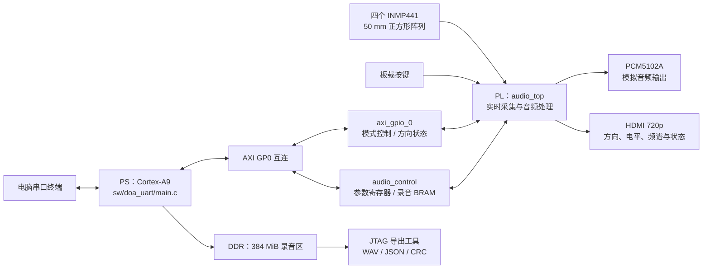
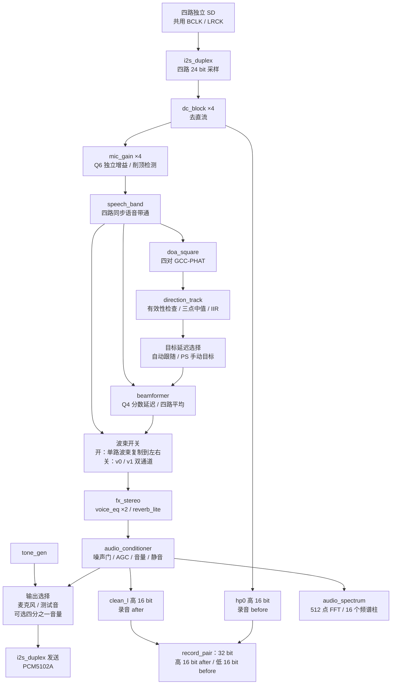
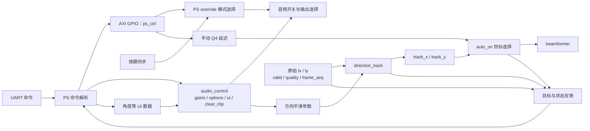
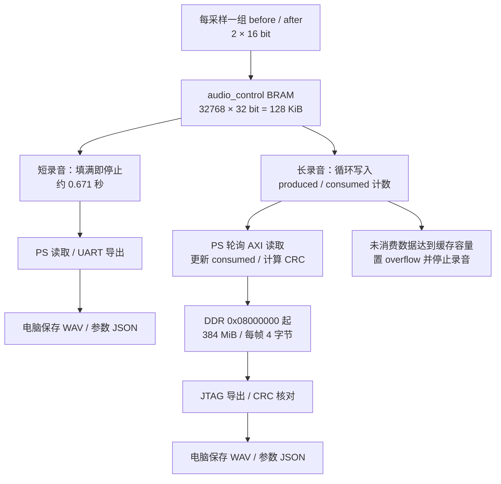
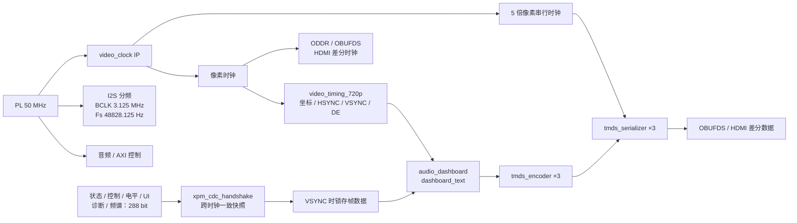
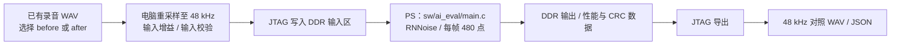

# AX7010 AUDIO PRO 项目逻辑图

依据当前 RTL、`scripts/create_bd.tcl` 和 PS 源码整理。本文描述源码连接关系，不代表本次重新完成上板验证。

## 1. 系统整体架构

Vivado 实际顶层为 `audio_ps_wrapper`，封装 `audio_ps.bd`。`audio_top` 是 PL 功能顶层；`audio_control` 是独立的 AXI4-Lite 控制与采集模块。长录音由 PS 读取 BRAM 后写入 DDR，当前没有 AXI DMA 音频搬运通路。

## 2. 实时音频数据流

- 主处理数据为有符号 24 bit；DOA 和 FFT 使用高 16 bit。
- 语音带通档位：关闭、150–6000 Hz、300–6000 Hz、300–3400 Hz。
- DOA 默认使用独立 GCC-PHAT FFT/IFFT 核：512 点双缓冲，四对互功率谱/PHAT/IFFT，搜索 ±8 个采样延迟、Q4 三点插值；能量/峰置信度不足时保持方向。原时域互相关保留为显式 GCC_PHAT=0 回退。
- 波束成形使用四路延迟叠加、线性分数插值，公共基准延迟为 32 个采样；这不是整个系统的端到端延迟。
- audio_spectrum 的 FFT 只负责显示；DOA 使用独立 doa_fft512 运算核，GCC-PHAT 真正参与方向估计。两核都没有用于实时音频降噪。
- `before` 已经过 `dc_block`，并非未经处理的 I2S 原始数据；`after` 位于输出选择和四分之一衰减之前，因此测试音模式下录音内容也不是 DAC 测试音。
- 顶层主要模块以 `i2s_duplex.sample_valid` 为采样使能。DOA 在 `speech_band.band_valid` 采集已提交的四通道数据；波束等原链路仍按连续采样流水处理。

## 3. 方向与控制逻辑

`ps_ctrl[0]` 决定使用 PS 参数还是板载按键。自动模式选择跟踪后的目标延迟；手动角度由 PS 转换为 X/Y 延迟后写入控制字。锁定目标属于 PS 控制逻辑。无有效结果时跟踪器保留已有目标，连续失效后重新准备平滑历史。

| 接口 | 作用 |
|---|---|
| `ps_ctrl` | 麦克风/测试音、EQ、波束、跟随、混响、噪声门、AGC、静音、平滑及手动延迟 |
| `ps_gains` | 四路 8 bit Q6 增益；64 为单位增益 |
| `ps_options` | 门限、Q7 音量、平滑参数、带通档位 |
| `ps_ui` | PS 计算的显示信息 |
| `ps_status` | 原始方向延迟、接受标志、质量及帧序号 |
| `ps_levels` | 增益后的四路电平 |
| `ps_diagnostics` | 削顶、门状态、AGC 增益、输出电平、录音及处理溢出 |
| `ps_target` | 当前用于波束成形的 X/Y 目标延迟 |

## 4. 录音与导出

长录音容量约 34 分 21.6 秒。PS 负责搬运和元数据管理，PL 负责采样和缓存写入；录音溢出会停止录音。实时音频输出是另一条硬件链路。

`audio_control` 基址为 `0x43C00000`，地址范围 `0x40000`，缓存窗口偏移为 `0x20000`。寄存器包括参数、录音命令、状态、诊断、目标、生产/消费计数和录音帧数上限。

## 5. HDMI 显示与时钟

视频 IP 请求像素/串行时钟分别为 74.25/371.25 MHz；实际输出频率以生成 IP 和实现报告为准。显示分辨率为 1280×720。音频与 AXI 使用同一物理 50 MHz 时钟；音频复位结合启动计数和 AXI 复位，视频复位由时钟 IP 的 `locked` 控制。

## 6. PS AI 离线处理（独立流程）

RNNoise 源码在 `third_party/rnnoise`。当前流程用于离线推理和性能评估，尚无 PS 音频写回 PL 的实时接口，因此不能把 AI 节点画入现有实时 DAC 链路。

## 7. 工程文件对应关系

| 目录/文件 | 职责 |
|---|---|
| `scripts/create_project.tcl`、`create_bd.tcl` | 建立 Vivado 工程、视频时钟 IP、PS/AXI 连接和顶层封装 |
| `rtl/audio_top.v` | 实时音频、方向、录音抽头与显示连接 |
| `rtl/audio_control.v` | AXI4-Lite 参数寄存器与 BRAM 采集缓存 |
| `rtl/doa_square.v`、`direction_track.v`、`beamformer.v` | 方位估计、稳定跟踪和定向拾音 |
| `rtl/fx_stereo.v`、`voice_eq.v`、`reverb_lite.v`、`audio_conditioner.v` | 音效及输出调理 |
| `rtl/audio_hdmi.v`、`audio_dashboard.v`、`dashboard_text.v` | 状态跨时钟、仪表盘和文字显示 |
| `sw/doa_uart/main.c` | 裸机控制、校准、状态处理与长录音搬运 |
| `sw/ai_eval/main.c`、`third_party/rnnoise` | PS 离线 AI 推理与性能统计 |
| `sim/`、`scripts/test*.tcl` | 模块和链路仿真 |
| `constr/ax7010_audio.xdc` | 板级引脚和时序约束 |

阅读顺序：`create_bd.tcl` → `audio_top.v` → 音频/方向子模块 → `audio_control.v` → `sw/doa_uart/main.c` → 显示链路 → 离线 AI。

## 9. Design source 逐文件参数索引

以下为 RTL 设计源的精确功能索引；参数以源码为准。

| 文件 | 功能与关键参数 |
|---|---|
| `audio_top.v` | PL顶层；50MHz；连接采集、预处理、DOA、波束、音效、调理、FFT、录音和HDMI；音频24bit；录音帧为after/before各16bit。 |
| `i2s_duplex.v` | 四麦输入+DAC输出；BCLK=3.125MHz，LRCK=48.828125kHz，24bit有效数据，I2S左时隙。 |
| `dc_block.v` | 4路一阶高通；约120Hz；反馈63/64；24bit输入输出，28bit内部。 |
| `mic_gain.v` | 4路独立增益；8bit Q6，默认64；乘积33bit；24bit限幅和削顶标志。 |
| `speech_band.v` | 4路同步带通；3个二阶节/通道；Q16系数，18bit；模式：off/150–6000/300–6000/300–3400Hz；50bit累加。 |
| `doa_square.v` | 默认 GCC_PHAT=1；512点双缓冲、±8样点 GCC-PHAT、4组麦对、Q4峰值插值；9bit有符号X/Y；能量门限2097152；内部核为 doa_gcc_phat/doa_fft512。 |
| `direction_track.v` | 3点中值+IIR；shift=1～7，默认2；内部Q6；方向有效半径平方3249～21904。 |
| `beamformer.v` | 128×24bit/路循环缓存；基准延迟32样点；Q4线性插值；四路平均，启动填充96样点。 |
| `fx_stereo.v` | 双通道音效组合；2个EQ+1个混响；混响注入量为1/8。 |
| `voice_eq.v` | 二阶语音EQ；约3kHz、+5dB、Q=0.9；Q14系数；48bit累加。 |
| `reverb_lite.v` | 4梳状延迟2039/2281/2591/3001样点+277样点全通；反馈0.625，全通系数0.5；24bit缓存。 |
| `audio_conditioner.v` | 噪声门、AGC、音量、静音；门保持4096样点；AGC Q8范围32～2048；音量Q7，0～128；24bit输出。 |
| `tone_gen.v` | 1kHz测试音；32bit相位累加；步进87960930；64点正弦表；16bit峰值±20000。 |
| `audio_spectrum.v` | 512点、9级基2 FFT；每级除2；16个显示bin；频率间隔95.3674Hz；输出128bit频谱柱。 |
| `audio_hdmi.v` | 288bit状态快照跨时钟；VSYNC锁存；3路TMDS编码/串行；差分HDMI输出。 |
| `video_timing_720p.v` | 1280×720；H总1650、V总750；前肩/同步/后肩H=110/40/220，V=5/5/20。 |
| `audio_dashboard.v` | 24bit RGB仪表盘；中心(640,360)；Q4方向映射2像素；4路电平和16柱频谱。 |
| `dashboard_text.v` | 5×7点阵；普通字2倍，角度数字4倍；3位角度显示。 |
| `tmds_encoder.v` | 8bit颜色编码为10bit TMDS；6bit运行差值；消隐控制码。 |
| `tmds_serializer.v` | 两级OSERDESE2；10bit DDR串行；串行时钟为像素时钟5倍。 |
| `audio_control.v` | AXI4-Lite寄存器+32768×32bit BRAM；基址0x43C00000；缓存128KiB；支持短录音和连续录音溢出检测。 |

## 10. 系统源与软件

- `audio_ps.bd`：Processing System7、DDR3 32bit/533.333MHz、CPU配置上限667MHz、UART1 115200、AXI GP0、双通道32bit GPIO、无音频DMA。
- `audio_ps_wrapper.v`：Vivado生成顶层，目标 `xc7z010clg400-1`，导出DDR、50MHz、按键、四麦、I2S、LED和HDMI。
- `video_clock`：输入50MHz，请求74.25MHz像素时钟和371.25MHz串行时钟，带locked复位。
- `sw/doa_uart/main.c`：串口控制、角度换算、校准和录音搬运；DDR录音区0x08000000起，384MiB，最长约2061.6秒。
- `sw/ai_eval/main.c`：PS离线RNNoise；48kHz、16bit、480点/帧（10ms）；不在实时DAC链路中。
